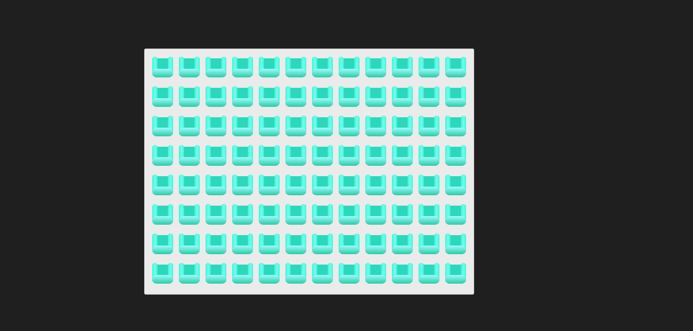

Let's import the `TicketWidget` component, and render it inside `App`:

This component is partially done. It contains some of the required UI, but not all. (I wonder if this is the work of the dev that started Slingshot Air but never finished... Seems like we're always cleaning up after someone. 😅)

This `TicketWidget` component has the following responsibilities:

- Subscribe to the React context with `useContext`
- Use the `numOfSeats` and `seatsPerRow` state to render the correct number of seats.

When you're done, you should have a UI like this:



Critically, you'll notice that there are 8 rows, with 12 seats per row. This is because this is what the server tells us, with the `numOfSeats` and `seatsPerRow` variables. Your job is to take this data and produce this UI :)

_HINT:_ Remember, the image is provided in `src/assets/seat-available.svg`. Images can be `import`ed just like JS modules!

```js
import happyMealSrc from "../assets/happy-meal.jpg";

const McDonalds = () => {
  return ;
};
```

_HINT:_ You can use the `range` function, provided in `src/utils`. For example:

```js
const SomeComponent = () => {
  return (
    <div>
      {range(5).map((index) => (
        <span>{index}</span>
      ))}
    </div>
  );
};

// This will render:
<div>
  <span>0</span>
  <span>1</span>
  <span>2</span>
  <span>3</span>
  <span>4</span>
</div>;
```

_HINT:_ You'll need to use `React.useContext(SeatContext)` to get the data.
