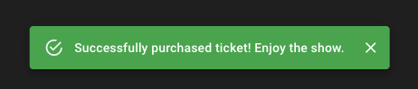

# Exercise 9: Finishing touches

We're in pretty good shape! There are a few final things we should add though.

1. Snackbar

If we successfully purchase a ticket, we want to show a success snackbar:

This is a component from Material UI. We can use the `BookingContext` status to decide whether to show it (if the `status` is `purchased`). Additionally, we need to be able to dismiss it; create a new action that sets the status back to `idle`, which will automatically hide the snackbar.

2. Marking the seat as sold

If the "A-1" seat in the corner is available, I can go through the flow and purchase it. The server will mark it as sold, but after the modal closes, the seat will still be green on my screen!

If I refresh the page, the seat will correctly be marked as unavailable, but we should do that automatically.

To do this, we'll need to add a new action to our `SeatContext`. The type should be `mark-seat-as-purchased`, and it should be dispatched after the seat has been purchased. It should update the seat to `isBooked: true`.
