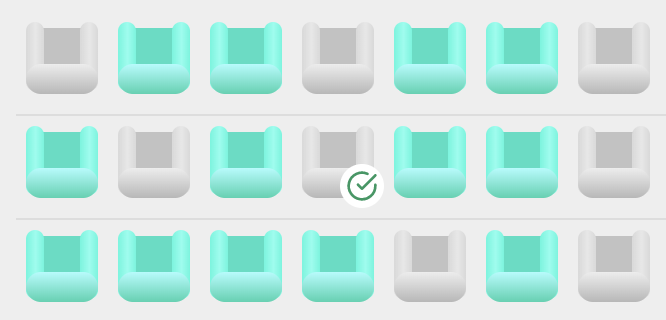

# More Stretch Goals

## Stretch goal 1: Decorated seats

After purchasing a seat, it becomes grey, the same as any other unavailable seat. Ideally, this seat would be visually distinct, to indicate that the current user has purchased it! Maybe a checkmark could be shown on top of it?

## Stretch goal 2: Purchasing multiple seats

Right now, seats can only be purchased one at a time. We can imagine maybe someone would like to buy multiple seats at once.

Update the UI so that clicking a seat "selects" it, and as long as at least 1 seat is selected, a "Buy" button is shown, below the seating plan. Clicking the "Buy" button opens the modal, and all selected seats are shown in the modal. The total price should equal to the sum total of all selected seats.

## Stretch goal 3: Responsive design

Expose the development server to the internet using something like [ngrok](https://ngrok.com/), and access the page on your phone. Is it usable? Does it look right?

Chances are, there are visual issues with this UI. Update it so that it looks and works great on a mobile device

**HINT:** On mobile devices, large tap targets are key. If you try and squeeze 12 seats per row onto a narrow phone, the seats will be too tiny to tap! Instead, allow mobile users to swipe horizontally to view all seats.
